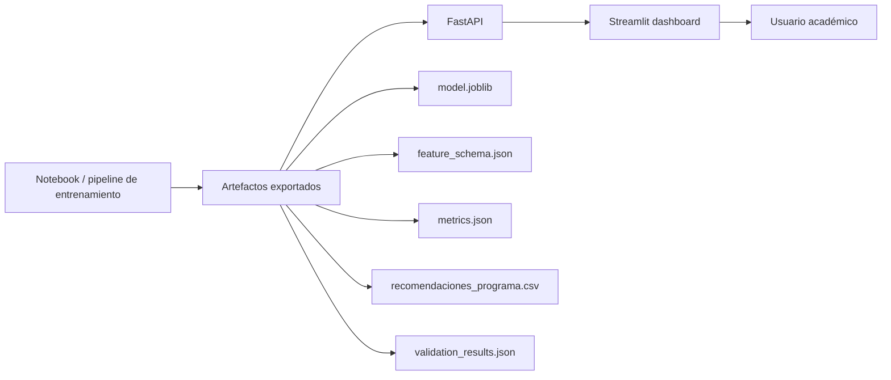

# Validación y explicación del notebook `modelo_medicina.ipynb`

> **⚠️ Nota de actualización (2026-07-13):** Este documento describe el notebook **v1** (entrenado con datos 2020-2024, 10 features, modelo Random Forest). El modelo vigente del proyecto es **Lasso v2** (entrenado con datos 2020-2025, 18 features, benchmark de 9 modelos). Ver [`README.md`](README.md) y [`documentos_para_estudiar/GUIA_TECNICA_MODELOS.md`](documentos_para_estudiar/GUIA_TECNICA_MODELOS.md) para los detalles del modelo actual.

Este documento explica, parte por parte, qué hace el notebook, qué código se ejecuta y qué resultado se obtuvo al probarlo con el archivo `saber_pro_limpio(in).csv`.

## Resultado general de la prueba

El notebook fue ejecutado correctamente de principio a fin.

| Elemento validado | Resultado |
|---|---:|
| Archivo fuente local | `saber_pro_limpio(in).csv` |
| Filas del dataset completo | 127716 |
| Columnas del dataset completo | 24 |
| Filas filtradas para Medicina | 2250 |
| Columnas de `solo_medicina` | 24 |
| Filas de `model_data` | 2250 |
| Columnas de `model_data` | 15 |
| Duplicados exactos en Medicina | 0 |
| Periodo cubierto | 2020 a 2024 |

También se generó una copia ejecutada del notebook:

```text
modelo_medicina_executed.ipynb
```

---

## 1. Objetivo del notebook

El notebook trabaja el proyecto definido en `PDR.md`:

> Modelo de Inteligencia Artificial para el análisis y predicción del desempeño de los programas de Medicina en las Pruebas Saber Pro.

La variable objetivo inicial definida fue:

```python
TARGET = 'PROMEDIO_GLOBAL'
```

Esto significa que el modelo buscará predecir el promedio global de desempeño de los programas de Medicina.

---

## 2. Imports básicos

Código:

```python
import numpy as np
import pandas as pd

pd.set_option('display.max_columns', None)
pd.set_option('display.max_rows', 100)
```

### Explicación

- `numpy` se usa para operaciones numéricas.
- `pandas` se usa para cargar, transformar y analizar tablas de datos.
- `display.max_columns` permite ver todas las columnas del DataFrame.
- `display.max_rows` permite mostrar más filas cuando se imprimen tablas.

### Resultado de ejecución

La celda se ejecutó sin errores.

---

## 3. Carga del dataset

Código principal:

```python
from pathlib import Path

sheet_id = '183VPzuoWWNPnmY5pfBpC9DOowLgCU7Kbgb2Q64Lh9Qo'
csv_url = f'https://docs.google.com/spreadsheets/d/{sheet_id}/export?format=csv'

possible_paths = [
    Path('saber_pro_limpio(in).csv'),
    Path('saber_pro_limpio.csv'),
    Path('/content/saber_pro_limpio(in).csv'),
    Path('/content/saber_pro_limpio.csv'),
    Path('/content/drive/MyDrive/saber_pro_limpio(in).csv'),
    Path('/content/drive/MyDrive/saber_pro_limpio.csv'),
]

csv_path = next((p for p in possible_paths if p.exists()), None)

if csv_path is not None:
    df = pd.read_csv(csv_path)
    fuente_datos = str(csv_path)
else:
    df = pd.read_csv(csv_url)
    fuente_datos = csv_url
```

### Explicación

Esta celda intenta cargar el dataset desde varias fuentes, en este orden:

1. archivo local en la misma carpeta del notebook;
2. archivo subido a `/content` en Colab;
3. archivo guardado en Google Drive;
4. enlace público de Google Sheets como CSV.

Esto hace que el notebook sirva tanto en VS Code como en Colab.

### Resultado de ejecución

```text
Fuente de datos: saber_pro_limpio(in).csv
Filas: 127716
Columnas: 24
```

El archivo fue leído correctamente desde la carpeta local del proyecto.

---

## 4. Filtro para Medicina

Código:

```python
solo_medicina = df[df['NBC'].astype(str).str.upper().eq('MEDICINA')].copy()

print(f'Filas medicina: {solo_medicina.shape[0]}')
print(f'Columnas: {solo_medicina.shape[1]}')
solo_medicina.head()
```

### Explicación

La columna `NBC` identifica el núcleo básico de conocimiento. El filtro deja solamente los registros donde:

```text
NBC = MEDICINA
```

Se usa `str.upper()` para evitar problemas si algún valor aparece en minúscula o con combinación de mayúsculas/minúsculas.

La función `.copy()` crea un DataFrame independiente llamado:

```python
solo_medicina
```

### Resultado de ejecución

```text
Filas medicina: 2250
Columnas: 24
```

Validación adicional:

- Todos los registros de `solo_medicina` tienen `NBC = MEDICINA`.
- No se incluyó `MEDICINA VETERINARIA` porque el filtro exige coincidencia exacta.

---

## 5. Columnas disponibles

Código:

```python
solo_medicina.columns.tolist()
```

### Explicación

Muestra todas las columnas disponibles después del filtro de Medicina.

### Resultado de ejecución

El DataFrame contiene estas 24 columnas:

```text
AÑO
ID_PAIS
ID_REGION
NOMBRE_REGION
ID_DEPARTAMENTO
NOMBRE_DEPARTAMENTO
ID_MUNICIPIO
NOMBRE_MUNICIPIO
ID_INSTITUCION
NOMBRE_INSTITUCION
ID_NBC
NBC
ID_PROGRAMA_ACAD
NOMBRE_PROGRAMA_ACAD
NOMBRE_PRUEBA
CATEGORIAPRUEBA
CANTIDADEVALUADOS
PROMEDIO_PRUEBA
DESVIACION
PROMEDIO_GLOBAL
NIVEL1
NIVEL2
NIVEL3
NIVEL4
```

---

## 6. Tipos de datos

Código:

```python
solo_medicina.dtypes.to_frame('tipo_dato')
```

### Explicación

Permite saber si cada variable es texto, número, identificador, año o resultado numérico.

### Resultado de ejecución

Hallazgos principales:

- `AÑO` quedó como texto (`str`).
- Los identificadores quedaron como `float64`.
- Las variables de resultados (`PROMEDIO_GLOBAL`, `PROMEDIO_PRUEBA`, `DESVIACION`, `NIVEL1` a `NIVEL4`) quedaron como numéricas.

Esto funciona para el análisis inicial. Más adelante, en limpieza o ingeniería de características, conviene convertir `AÑO` a entero.

---

## 7. Clasificación inicial de variables

Código:

```python
columnas_temporales = ['AÑO']
columnas_geograficas = [
    'ID_PAIS', 'ID_REGION', 'NOMBRE_REGION',
    'ID_DEPARTAMENTO', 'NOMBRE_DEPARTAMENTO',
    'ID_MUNICIPIO', 'NOMBRE_MUNICIPIO'
]
columnas_institucion = ['ID_INSTITUCION', 'NOMBRE_INSTITUCION']
columnas_programa = ['ID_NBC', 'NBC', 'ID_PROGRAMA_ACAD', 'NOMBRE_PROGRAMA_ACAD']
columnas_prueba = ['NOMBRE_PRUEBA', 'CATEGORIAPRUEBA']
columnas_numericas_resultado = [
    'CANTIDADEVALUADOS', 'PROMEDIO_PRUEBA', 'DESVIACION',
    'PROMEDIO_GLOBAL', 'NIVEL1', 'NIVEL2', 'NIVEL3', 'NIVEL4'
]
```

### Explicación

Agrupa las columnas por función analítica:

| Grupo | Para qué sirve |
|---|---|
| Temporal | Analizar evolución por año |
| Geográfica | Comparar región, departamento y municipio |
| Institución | Comparar universidades |
| Programa | Identificar programas académicos |
| Prueba | Diferenciar módulos evaluados |
| Resultado | Analizar desempeño y métricas Saber Pro |

### Resultado de ejecución

La tabla `resumen_variables` se generó correctamente.

---

## 8. Valores faltantes

Código:

```python
faltantes = solo_medicina.isna().sum().to_frame('faltantes')
faltantes['porcentaje'] = (faltantes['faltantes'] / len(solo_medicina) * 100).round(2)
faltantes.sort_values('faltantes', ascending=False)
```

### Explicación

Cuenta cuántos valores nulos tiene cada columna y calcula su porcentaje sobre el total de registros de Medicina.

### Resultado de ejecución

La única columna con faltantes relevantes fue:

| Columna | Faltantes | Porcentaje |
|---|---:|---:|
| DESVIACION | 32 | 1.42% |

Interpretación:

- El dataset de Medicina está bastante completo.
- `DESVIACION` tiene pocos faltantes.
- Como `DESVIACION` además puede implicar riesgo de fuga de información, no se incluye en el primer conjunto conservador de predictores.

---

## 9. Duplicados exactos

Código:

```python
duplicados = solo_medicina.duplicated().sum()
print(f'Duplicados exactos: {duplicados}')
```

### Explicación

Busca filas completamente repetidas.

### Resultado de ejecución

```text
Duplicados exactos: 0
```

No se encontraron registros duplicados exactos en `solo_medicina`.

---

## 10. Valores únicos

Código:

```python
unicos = solo_medicina.nunique(dropna=False).to_frame('valores_unicos')
unicos.sort_values('valores_unicos', ascending=False)
```

### Explicación

Cuenta cuántos valores distintos tiene cada columna. Esto ayuda a entender cardinalidad y complejidad del modelado.

### Resultado de ejecución destacado

| Variable | Valores únicos |
|---|---:|
| CANTIDADEVALUADOS | 205 |
| PROMEDIO_PRUEBA | 129 |
| ID_PROGRAMA_ACAD | 75 |
| PROMEDIO_GLOBAL | 63 |
| NOMBRE_INSTITUCION | 52 |
| NOMBRE_MUNICIPIO | 21 |
| NOMBRE_DEPARTAMENTO | 19 |
| NOMBRE_PRUEBA | 8 |
| AÑO | 5 |

Interpretación:

- Hay 52 instituciones y 75 programas académicos identificados.
- El periodo tiene 5 años.
- `NOMBRE_PRUEBA` tiene 8 módulos o pruebas.

---

## 11. Rango temporal

Código:

```python
solo_medicina['AÑO'].agg(['min', 'max']).to_frame('AÑO')
```

### Resultado de ejecución

```text
Año mínimo: 2020
Año máximo: 2024
```

Interpretación:

El dataset permite analizar evolución histórica de Medicina entre 2020 y 2024.

---

## 12. Estadística descriptiva

Código:

```python
solo_medicina[columnas_numericas_resultado].describe().T
```

### Explicación

Calcula medidas estadísticas para las variables numéricas principales:

- cantidad de datos;
- promedio;
- desviación estándar;
- mínimo;
- percentiles;
- máximo.

### Resultado de ejecución destacado

| Variable | Media | Mínimo | Máximo |
|---|---:|---:|---:|
| CANTIDADEVALUADOS | 110.272 | 1.0 | 396.0 |
| PROMEDIO_PRUEBA | 161.700 | 42.0 | 230.0 |
| DESVIACION | 28.754 | 0.0 | 76.0 |
| PROMEDIO_GLOBAL | 164.149 | 113.0 | 199.0 |
| NIVEL1 | 12.698 | 0.0 | 100.0 |
| NIVEL2 | 26.600 | 0.0 | 100.0 |
| NIVEL3 | 45.316 | 0.0 | 100.0 |
| NIVEL4 | 14.774 | 0.0 | 100.0 |

Interpretación inicial:

- El promedio global medio de Medicina es aproximadamente `164.149`.
- El rango de `PROMEDIO_GLOBAL` va de `113` a `199`.
- Hay programas/pruebas con cantidades muy bajas de evaluados, incluso `1`, lo cual debe revisarse en EDA porque puede generar alta variabilidad.

---

## 13. Variable objetivo y riesgo de fuga de información

Código:

```python
TARGET = 'PROMEDIO_GLOBAL'

variables_con_riesgo_leakage = [
    'PROMEDIO_PRUEBA', 'DESVIACION', 'NIVEL1', 'NIVEL2', 'NIVEL3', 'NIVEL4'
]
```

### Explicación

La variable objetivo es `PROMEDIO_GLOBAL`.

Las variables marcadas como posible `data leakage` son variables que podrían revelar información muy cercana al resultado final. Si se usan sin cuidado, el modelo puede parecer muy bueno, pero en realidad estaría aprendiendo datos derivados del mismo resultado que intenta predecir.

### Resultado de ejecución

```text
Target: PROMEDIO_GLOBAL

Predictoras base:
['AÑO', 'ID_REGION', 'NOMBRE_REGION', 'ID_DEPARTAMENTO', 'NOMBRE_DEPARTAMENTO', 'ID_MUNICIPIO', 'NOMBRE_MUNICIPIO', 'ID_INSTITUCION', 'NOMBRE_INSTITUCION', 'ID_PROGRAMA_ACAD', 'NOMBRE_PROGRAMA_ACAD', 'NOMBRE_PRUEBA', 'CATEGORIAPRUEBA', 'CANTIDADEVALUADOS']

Variables con posible leakage:
['PROMEDIO_PRUEBA', 'DESVIACION', 'NIVEL1', 'NIVEL2', 'NIVEL3', 'NIVEL4']
```

---

## 14. Dataset inicial para modelado

Código:

```python
model_data = solo_medicina[posibles_predictoras_base + [TARGET]].dropna(subset=[TARGET]).copy()

print(f'Filas para modelado inicial: {model_data.shape[0]}')
print(f'Columnas para modelado inicial: {model_data.shape[1]}')
model_data.head()
```

### Explicación

Crea un dataset inicial para modelado conservador. Incluye:

- variables predictoras base;
- la variable objetivo `PROMEDIO_GLOBAL`;
- exclusión de filas sin target.

No incluye las variables con riesgo de leakage.

### Resultado de ejecución

```text
Filas para modelado inicial: 2250
Columnas para modelado inicial: 15
```

Interpretación:

- No se perdieron filas al exigir `PROMEDIO_GLOBAL`, porque no tiene valores faltantes en Medicina.
- El dataset queda listo para la próxima etapa: EDA y luego preparación para Machine Learning.

---

## 15. Pruebas realizadas

Se ejecutaron estas validaciones:

```python
assert csv_path.exists()
assert df.shape == (127716, 24)
assert 'NBC' in df.columns
assert 'PROMEDIO_GLOBAL' in df.columns
assert solo_medicina.shape == (2250, 24)
assert set(solo_medicina['NBC'].dropna().unique()) == {'MEDICINA'}
assert model_data.shape == (2250, 15)
```

### Resultado

```text
VALIDATION_OK
```

Además, el notebook se ejecutó completo con `nbclient` y se guardó el resultado en:

```text
modelo_medicina_executed.ipynb
```

---

## 16. Observaciones importantes

1. El notebook ahora busca primero archivos locales antes de usar Google Sheets.
2. Esto evita fallos cuando se trabaja desde VS Code con el CSV en la misma carpeta.
3. En Colab también funciona si el archivo está subido a `/content` o en Drive.
4. El filtro por Medicina usa coincidencia exacta, por eso no mezcla Medicina con Medicina Veterinaria.
5. `PROMEDIO_GLOBAL` queda definido como objetivo principal.
6. Las variables `PROMEDIO_PRUEBA`, `DESVIACION`, `NIVEL1`, `NIVEL2`, `NIVEL3` y `NIVEL4` deben tratarse con cuidado por posible fuga de información.

---

## 17. EDA documentado

Se agregó la etapa **3. Análisis Exploratorio de Datos (EDA)** al notebook. Esta etapa complementa la comprensión del dataset con gráficas e interpretación antes de pasar a ingeniería de características o modelos predictivos.

---

### 17.1 Preparación de datos para EDA

Código principal:

```python
eda_data = solo_medicina.copy()
eda_data['AÑO'] = pd.to_numeric(eda_data['AÑO'], errors='coerce').astype('Int64')

print(f'Filas para EDA: {eda_data.shape[0]}')
print(f'Columnas para EDA: {eda_data.shape[1]}')
print(f'Años disponibles: {eda_data["AÑO"].min()} - {eda_data["AÑO"].max()}')
```

#### Explicación

Se crea una copia llamada `eda_data` para no modificar directamente `solo_medicina`. Además, `AÑO` se convierte a valor numérico para poder ordenar y graficar correctamente la evolución temporal.

#### Resultado observado

```text
Filas para EDA: 2250
Columnas para EDA: 24
Años disponibles: 2020 - 2024
```

---

### 17.2 Distribución de `PROMEDIO_GLOBAL`

Código principal:

```python
fig, axes = plt.subplots(1, 2, figsize=(14, 5))

sns.histplot(data=eda_data, x=TARGET, bins=25, kde=True, ax=axes[0])
sns.boxplot(data=eda_data, x=TARGET, ax=axes[1])

plt.tight_layout()
plt.show()

eda_data[TARGET].describe().to_frame('PROMEDIO_GLOBAL')
```

#### Explicación

Se generan dos gráficos:

- histograma con curva KDE para ver la forma de la distribución;
- boxplot para revisar mediana, rango intercuartílico y posibles valores atípicos.

#### Resultado observado

| Métrica | Valor |
|---|---:|
| Registros | 2250 |
| Media | 164.149 |
| Desviación estándar | 15.638 |
| Mínimo | 113.0 |
| Q1 | 152.0 |
| Mediana | 163.0 |
| Q3 | 175.0 |
| Máximo | 199.0 |

#### Interpretación

El desempeño global de Medicina se concentra alrededor de 163-164 puntos. El rango típico está entre 152 y 175 puntos. Hay algunos valores bajos que deben revisarse como posibles outliers.

---

### 17.3 Evolución anual 2020-2024

Código principal:

```python
evolucion_anual = (
    eda_data
    .groupby('AÑO')
    .agg(
        promedio_global_medio=(TARGET, 'mean'),
        promedio_global_mediano=(TARGET, 'median'),
        registros=(TARGET, 'size')
    )
    .reset_index()
)

sns.lineplot(data=evolucion_anual, x='AÑO', y='promedio_global_medio', marker='o')
```

#### Explicación

Agrupa los registros por año y calcula promedio, mediana y cantidad de registros. La línea permite ver la tendencia temporal del desempeño global.

#### Resultado observado

| Año | Promedio global medio | Mediana | Registros |
|---:|---:|---:|---:|
| 2020 | 167.98 | 168.5 | 290 |
| 2021 | 164.16 | 164.0 | 413 |
| 2022 | 163.11 | 161.0 | 502 |
| 2023 | 163.52 | 162.0 | 529 |
| 2024 | 163.65 | 160.0 | 516 |

#### Interpretación

El promedio global fue más alto en 2020 y luego bajó en 2021-2022. Entre 2022 y 2024 se observa mayor estabilidad, con promedios alrededor de 163 puntos. Esta tendencia debe analizarse con más detalle en la etapa de ingeniería de características.

---

### 17.4 Comparación por región

Código principal:

```python
region_stats = (
    eda_data
    .groupby('NOMBRE_REGION')
    .agg(
        promedio_global_medio=(TARGET, 'mean'),
        promedio_global_mediano=(TARGET, 'median'),
        desviacion=(TARGET, 'std'),
        registros=(TARGET, 'size')
    )
    .sort_values('promedio_global_medio', ascending=False)
    .reset_index()
)

sns.boxplot(data=eda_data, x='NOMBRE_REGION', y=TARGET, order=orden_regiones)
```

#### Explicación

Compara el desempeño global entre regiones usando estadísticas agregadas y boxplot.

#### Resultado observado

| Región | Promedio global medio | Registros | Desviación |
|---|---:|---:|---:|
| PACÍFICA | 168.18 | 312 | 14.97 |
| ANDINA | 166.42 | 1445 | 15.52 |
| CARIBE | 154.93 | 493 | 12.58 |

#### Interpretación

La región Pacífica tiene el promedio más alto, seguida por Andina. Caribe queda por debajo en el promedio global. Sin embargo, Andina concentra la mayor cantidad de registros, por lo que las comparaciones deben considerar el desbalance regional.

---

### 17.5 Comparación por departamento

Código principal:

```python
departamento_stats = (
    eda_data
    .groupby('NOMBRE_DEPARTAMENTO')
    .agg(
        promedio_global_medio=(TARGET, 'mean'),
        promedio_global_mediano=(TARGET, 'median'),
        registros=(TARGET, 'size')
    )
    .sort_values('promedio_global_medio', ascending=False)
    .reset_index()
)

sns.barplot(
    data=departamento_stats,
    y='NOMBRE_DEPARTAMENTO',
    x='promedio_global_medio'
)
```

#### Explicación

Calcula el promedio global por departamento y lo visualiza en barras ordenadas.

#### Resultado observado destacado

Departamentos con mayor promedio:

| Departamento | Promedio global medio | Registros |
|---|---:|---:|
| CUNDINAMARCA | 185.11 | 36 |
| RISARALDA | 175.89 | 36 |
| CAUCA | 173.93 | 41 |
| CALDAS | 168.83 | 72 |
| VALLE | 168.36 | 242 |

Departamentos con menor promedio:

| Departamento | Promedio global medio | Registros |
|---|---:|---:|
| NARIÑO | 158.59 | 29 |
| HUILA | 158.33 | 69 |
| MAGDALENA | 152.84 | 144 |
| BOLIVAR | 148.93 | 120 |
| CORDOBA | 146.16 | 49 |

#### Interpretación

Cundinamarca aparece con el promedio más alto, pero tiene solo 36 registros. Esto no invalida el resultado, pero exige cautela. Los departamentos con pocos registros pueden mostrar promedios más sensibles a valores extremos.

---

### 17.6 Top instituciones por promedio con suficientes registros

Código principal:

```python
MIN_REGISTROS_INSTITUCION = 20

institucion_stats = (
    eda_data
    .groupby('NOMBRE_INSTITUCION')
    .agg(
        promedio_global_medio=(TARGET, 'mean'),
        promedio_global_mediano=(TARGET, 'median'),
        registros=(TARGET, 'size'),
        cantidad_evaluados_total=('CANTIDADEVALUADOS', 'sum')
    )
    .reset_index()
)

instituciones_suficientes = institucion_stats[
    institucion_stats['registros'] >= MIN_REGISTROS_INSTITUCION
]
```

#### Explicación

Se arma un ranking institucional solo con instituciones que tengan al menos 20 registros. Esto evita destacar instituciones con resultados poco representativos.

#### Resultado observado: top 10

| Institución | Promedio global medio | Registros |
|---|---:|---:|
| UNIVERSIDAD DE LOS ANDES | 194.50 | 36 |
| UNIVERSIDAD ICESI | 189.28 | 36 |
| UNIVERSIDAD NACIONAL DE COLOMBIA | 188.67 | 36 |
| COLEGIO MAYOR DE NUESTRA SEÑORA DEL ROSARIO | 188.17 | 36 |
| PONTIFICIA UNIVERSIDAD JAVERIANA | 187.47 | 72 |
| UNIVERSIDAD DEL VALLE | 185.87 | 31 |
| UNIVERSIDAD CES | 185.28 | 36 |
| UNIVERSIDAD DE LA SABANA | 185.11 | 36 |
| FUNDACION UNIVERSIDAD DEL NORTE | 184.36 | 36 |
| UNIVERSIDAD PONTIFICIA BOLIVARIANA | 183.39 | 36 |

#### Interpretación

El ranking es descriptivo, no causal. No se debe concluir que una institución produce mejores resultados solo por aparecer arriba. Puede haber factores de selección, ubicación, tamaño de cohorte o características del programa.

---

### 17.7 Distribución de `CANTIDADEVALUADOS`

Código principal:

```python
fig, axes = plt.subplots(1, 2, figsize=(14, 5))

sns.histplot(data=eda_data, x='CANTIDADEVALUADOS', bins=30, kde=True, ax=axes[0])
sns.boxplot(data=eda_data, x='CANTIDADEVALUADOS', ax=axes[1])

plt.tight_layout()
plt.show()

eda_data['CANTIDADEVALUADOS'].describe().to_frame('CANTIDADEVALUADOS')
```

#### Explicación

Analiza el tamaño de las observaciones, es decir, cuántos estudiantes evaluados hay por registro.

#### Resultado observado

| Métrica | Valor |
|---|---:|
| Registros | 2250 |
| Media | 110.272 |
| Desviación estándar | 73.067 |
| Mínimo | 1.0 |
| Q1 | 58.0 |
| Mediana | 102.0 |
| Q3 | 147.0 |
| Máximo | 396.0 |

#### Interpretación

Existen registros con muy pocos evaluados, incluso 1. Esto es importante porque promedios calculados con pocos estudiantes pueden ser menos estables. Más adelante se puede evaluar un umbral mínimo o ponderar por cantidad de evaluados.

---

### 17.8 Outliers en `PROMEDIO_GLOBAL` usando IQR

Código principal:

```python
q1 = eda_data[TARGET].quantile(0.25)
q3 = eda_data[TARGET].quantile(0.75)
iqr = q3 - q1
limite_inferior = q1 - 1.5 * iqr
limite_superior = q3 + 1.5 * iqr

outliers_promedio_global = eda_data[
    (eda_data[TARGET] < limite_inferior) |
    (eda_data[TARGET] > limite_superior)
].copy()
```

#### Explicación

El método IQR detecta valores potencialmente atípicos. No elimina datos: solo los identifica para revisión.

#### Resultado observado

| Elemento | Valor |
|---|---:|
| Q1 | 152.00 |
| Q3 | 175.00 |
| IQR | 23.00 |
| Límite inferior | 117.50 |
| Límite superior | 209.50 |
| Outliers detectados | 5 |
| Porcentaje de outliers | 0.22% |

#### Interpretación

Los outliers detectados están por debajo del límite inferior. No deben eliminarse automáticamente; primero hay que revisar institución, año, prueba, programa y cantidad de evaluados.

---

### 17.9 Relación entre `CANTIDADEVALUADOS` y `PROMEDIO_GLOBAL`

Código principal:

```python
correlacion_evaluados_promedio = eda_data[['CANTIDADEVALUADOS', TARGET]].corr().iloc[0, 1]

sns.scatterplot(
    data=eda_data,
    x='CANTIDADEVALUADOS',
    y=TARGET,
    alpha=0.5
)
sns.regplot(
    data=eda_data,
    x='CANTIDADEVALUADOS',
    y=TARGET,
    scatter=False,
    color='red'
)
```

#### Explicación

El gráfico de dispersión muestra si los registros con más evaluados tienden a tener mayor o menor promedio global. La línea roja resume una tendencia lineal aproximada.

#### Resultado observado

```text
Correlación Pearson: 0.113
```

#### Interpretación

La correlación es positiva pero débil. Esto indica que la cantidad de evaluados no explica por sí sola el desempeño global, aunque sigue siendo una variable de contexto útil para modelado y análisis de estabilidad.

---

## 18. Pruebas actualizadas

Además de las validaciones iniciales, se probaron los nuevos cálculos de EDA:

```python
assert eda_data.shape == (2250, 24)
assert evolucion_anual.shape[0] == 5
assert set(evolucion_anual['AÑO'].astype(int)) == {2020, 2021, 2022, 2023, 2024}
assert region_stats.shape[0] == 3
assert departamento_stats.shape[0] == 19
assert len(outliers_promedio_global) == 5
assert round(correlacion_evaluados_promedio, 3) == 0.113
```

### Resultado

```text
EDA_VALIDATION_OK
```

El notebook también fue ejecutado en memoria con `nbclient` para validar que las celdas nuevas corren sin errores.

---

## 19. Observaciones importantes actualizadas

1. El EDA confirma que `PROMEDIO_GLOBAL` tiene media aproximada de `164.149` y mediana de `163.0`.
2. El desempeño promedio más alto se observa en 2020; desde 2021 se estabiliza cerca de 163 puntos.
3. Hay diferencias regionales: Pacífica y Andina superan a Caribe en promedio global.
4. Existen diferencias departamentales, pero deben interpretarse junto con el número de registros.
5. El ranking institucional es descriptivo y no debe leerse como causalidad.
6. `CANTIDADEVALUADOS` tiene valores muy bajos, por lo que se recomienda evaluar estabilidad y posibles ponderaciones en etapas posteriores.
7. El método IQR detectó 5 outliers de `PROMEDIO_GLOBAL`, equivalentes al 0.22% de los registros de Medicina.
8. La correlación entre cantidad de evaluados y promedio global es débil (`0.113`).

---

## 20. Ingeniería de Características

Se agregó la etapa **4. Ingeniería de Características** al notebook. Esta etapa convierte el dataset de Medicina en una tabla anual por institución y programa académico, y luego crea variables históricas para modelado sin usar información futura.

---

### 20.1 Dataset anual `medicina_anual`

Código principal:

```python
nivel_agregacion = [
    'AÑO',
    'ID_REGION', 'NOMBRE_REGION',
    'ID_DEPARTAMENTO', 'NOMBRE_DEPARTAMENTO',
    'ID_MUNICIPIO', 'NOMBRE_MUNICIPIO',
    'ID_INSTITUCION', 'NOMBRE_INSTITUCION',
    'ID_NBC', 'NBC',
    'ID_PROGRAMA_ACAD', 'NOMBRE_PROGRAMA_ACAD'
]

medicina_anual = (
    eda_data
    .groupby(nivel_agregacion, dropna=False)
    .agg(
        promedio_global_anual=(TARGET, 'mean'),
        promedio_prueba_media=('PROMEDIO_PRUEBA', 'mean'),
        cantidad_evaluados_media_pruebas=('CANTIDADEVALUADOS', 'mean'),
        cantidad_evaluados_max_pruebas=('CANTIDADEVALUADOS', 'max'),
        cantidad_pruebas=('NOMBRE_PRUEBA', 'nunique'),
        registros_modulo=('NOMBRE_PRUEBA', 'size')
    )
    .reset_index()
)
```

#### Explicación

El dataset original tiene varias filas para un mismo programa-año porque cada módulo de Saber Pro aparece como una observación distinta. Para crear variables históricas, primero se baja la granularidad al nivel:

```text
AÑO + institución + programa académico
```

Se mantienen identificadores y nombres para no perder trazabilidad.

La variable `CANTIDADEVALUADOS` no se suma porque eso podría duplicar estudiantes entre pruebas. En cambio, se calculan:

- `cantidad_evaluados_media_pruebas`: media de evaluados entre módulos;
- `cantidad_evaluados_max_pruebas`: máximo observado entre módulos.

Esta decisión es conservadora y evita inflar artificialmente el tamaño de la cohorte.

#### Resultado observado

```text
Filas en medicina_anual: 321
Columnas en medicina_anual: 19
```

Otros resultados:

| Métrica | Valor |
|---|---:|
| Mínimo de pruebas por programa-año | 5 |
| Máximo de pruebas por programa-año | 8 |
| Media de `promedio_global_anual` | 164.09 |

---

### 20.2 Dataset con features `medicina_features`

Código principal:

```python
llaves_programa = ['ID_INSTITUCION', 'ID_PROGRAMA_ACAD']

medicina_features = (
    medicina_anual
    .sort_values(llaves_programa + ['AÑO'])
    .reset_index(drop=True)
    .copy()
)

grupo_programa = medicina_features.groupby(llaves_programa, sort=False)

medicina_features['promedio_global_anterior'] = grupo_programa['promedio_global_anual'].shift(1)
medicina_features['variacion_anual'] = (
    medicina_features['promedio_global_anual'] - medicina_features['promedio_global_anterior']
)
```

También se crearon variables móviles e indicadores históricos:

```python
medicina_features['promedio_movil_2_anios'] = grupo_programa['promedio_global_anual'].transform(
    lambda serie: serie.shift(1).rolling(window=2, min_periods=1).mean()
)

medicina_features['desviacion_historica_2_anios'] = grupo_programa['promedio_global_anual'].transform(
    lambda serie: serie.shift(1).rolling(window=2, min_periods=2).std()
)
```

#### Explicación de variables creadas

| Variable | Qué significa | Para qué sirve |
|---|---|---|
| `promedio_global_anterior` | Resultado del año anterior del mismo programa | Captura desempeño histórico inmediato |
| `variacion_anual` | Diferencia contra el año anterior | Detecta mejora o caída absoluta |
| `variacion_porcentual` | Variación relativa porcentual | Permite comparar cambios relativos |
| `promedio_movil_2_anios` | Promedio de hasta dos años previos | Resume tendencia reciente |
| `desviacion_historica_2_anios` | Variabilidad de hasta dos años previos | Mide estabilidad reciente |
| `crecimiento_acumulado_desde_inicio` | Cambio frente al primer año observado | Resume evolución acumulada |
| `mejora_vs_anio_anterior` | 1 si mejora contra el año anterior | Señal interpretable de crecimiento |
| `disminuye_vs_anio_anterior` | 1 si cae contra el año anterior | Señal interpretable de deterioro |
| `anios_historicos_disponibles` | Cantidad de años previos disponibles | Indica profundidad histórica |

#### Salvaguarda contra fuga de información

Las variables históricas usan `shift(1)` antes del cálculo móvil. Por eso, el valor del año actual no participa en sus propias variables históricas.

Ejemplo:

```python
serie.shift(1).rolling(window=2).mean()
```

Primero desplaza la serie un año hacia atrás y recién después calcula el promedio móvil.

#### Resultado observado

```text
Filas en medicina_features: 321
Columnas en medicina_features: 28
Programas únicos con historia: 75
Filas con al menos un año histórico: 246
```

---

### 20.3 Valores faltantes esperados en features

Código principal:

```python
faltantes_features = medicina_features[columnas_features].isna().sum().to_frame('faltantes')
faltantes_features['porcentaje'] = (
    faltantes_features['faltantes'] / len(medicina_features) * 100
).round(2)
```

#### Resultado observado

| Feature | Faltantes | Porcentaje |
|---|---:|---:|
| `promedio_global_anterior` | 75 | 23.36% |
| `variacion_anual` | 75 | 23.36% |
| `variacion_porcentual` | 75 | 23.36% |
| `promedio_movil_2_anios` | 75 | 23.36% |
| `desviacion_historica_2_anios` | 144 | 44.86% |
| `crecimiento_acumulado_desde_inicio` | 0 | 0.00% |
| `mejora_vs_anio_anterior` | 0 | 0.00% |
| `disminuye_vs_anio_anterior` | 0 | 0.00% |
| `anios_historicos_disponibles` | 0 | 0.00% |

#### Interpretación

Los faltantes son esperados:

- hay 75 programas únicos, por eso la primera observación de cada programa no tiene año anterior;
- `desviacion_historica_2_anios` necesita dos valores históricos previos, por eso tiene más faltantes;
- los indicadores binarios quedan en 0 cuando no existe año anterior.

---

### 20.4 Validaciones de ingeniería de características

Código principal:

```python
primeras_observaciones = medicina_features[
    medicina_features['anios_historicos_disponibles'].eq(0)
]

assert medicina_features.shape[0] == medicina_anual.shape[0]
assert primeras_observaciones['promedio_global_anterior'].isna().all()
assert primeras_observaciones['variacion_anual'].isna().all()
assert primeras_observaciones['variacion_porcentual'].isna().all()
assert primeras_observaciones['promedio_movil_2_anios'].isna().all()
assert primeras_observaciones['desviacion_historica_2_anios'].isna().all()
assert (primeras_observaciones['crecimiento_acumulado_desde_inicio'].abs() < 1e-9).all()
```

#### Resultado observado

```text
FEATURE_ENGINEERING_VALIDATION_OK
Programas únicos con historia: 75
Primeras observaciones validadas: 75
Filas con al menos un año histórico: 246
```

#### Interpretación

Las pruebas confirman que las variables dependientes del pasado quedan vacías en la primera observación de cada programa. Esto valida la regla central de la etapa: no usar información futura ni información del mismo año como si fuera histórica.

---

## 21. Pruebas actualizadas con ingeniería de características

Además de las pruebas anteriores, se ejecutaron estas validaciones:

```python
assert medicina_anual.shape == (321, 19)
assert medicina_features.shape == (321, 28)
assert medicina_features[['ID_INSTITUCION', 'ID_PROGRAMA_ACAD']].drop_duplicates().shape[0] == 75
assert primeras_observaciones.shape[0] == 75
```

### Resultado

```text
FEATURE_ENGINEERING_VALIDATION_OK
FEATURE_SNIPPET_VALIDATION_OK
```

El notebook fue ejecutado completo con `nbclient` y la copia ejecutada se guardó en:

```text
modelo_medicina_executed.ipynb
```

---

## 22. Observaciones importantes de ingeniería de características

1. `medicina_anual` reduce 2250 registros de módulo/prueba a 321 registros anuales por institución-programa.
2. Se identifican 75 combinaciones institución-programa.
3. Hay 246 filas con al menos un año histórico disponible.
4. Las primeras observaciones por programa tienen faltantes en variables de año anterior, como corresponde.
5. No se suma `CANTIDADEVALUADOS` para evitar doble conteo entre módulos.
6. `PROMEDIO_PRUEBA` queda como variable descriptiva agregada, no como predictor principal conservador.
7. No se entrenó ningún modelo todavía.

---

## 23. Próximo paso recomendado

La siguiente etapa del PDR es **Entrenamiento y comparación de modelos**.

Antes de entrenar, conviene definir:

- partición temporal de entrenamiento, validación y prueba;
- variables predictoras finales;
- tratamiento de variables categóricas;
- manejo de faltantes históricos;
- métricas de evaluación para regresión: MAE, RMSE, MAPE y R².


---

## 24. Etapa 5: Entrenamiento y comparación inicial de modelos limpio pre-SHAP

Se aplicó una corrección metodológica antes de avanzar a SHAP: el modelo ya **no usa** variables de cantidad de evaluados del mismo periodo.

Las variables excluidas del modelado son:

```text
cantidad_evaluados_media_pruebas
cantidad_evaluados_max_pruebas
```

Estas columnas se mantienen en EDA e ingeniería de características como contexto descriptivo, pero no entran al modelo porque podrían no estar disponibles si la predicción debe hacerse antes de conocer cuántos estudiantes fueron evaluados.

### Nota de corrección

El benchmark anterior incluía `cantidad_evaluados_*` y queda **supersedido** para la etapa SHAP. Sus métricas anteriores eran:

| Modelo anterior | Validación MAE | Test MAE | Estado |
|---|---:|---:|---|
| Random Forest con `cantidad_evaluados_*` | 5.315 | 5.284 | Supersedido |

El modelo vigente para continuar es el benchmark limpio descrito abajo.

---

### 24.1 Variable objetivo

La variable objetivo del modelo es:

```python
TARGET_MODEL = 'promedio_global_anual'
```

Esta variable representa el promedio global anual agregado por institución y programa académico.

---

### 24.2 Variables predictoras usadas

Variables numéricas del modelo limpio:

```text
AÑO
promedio_global_anterior
promedio_movil_2_anios
desviacion_historica_2_anios
anios_historicos_disponibles
```

Variables categóricas del modelo limpio:

```text
NOMBRE_REGION
NOMBRE_DEPARTAMENTO
NOMBRE_MUNICIPIO
NOMBRE_INSTITUCION
NOMBRE_PROGRAMA_ACAD
```

Total de variables predictoras:

```text
10
```

---

### 24.3 Variables excluidas

Para evitar fuga de información o dependencia de información operativa del mismo periodo, se excluyen:

```text
promedio_global_anual
promedio_prueba_media
variacion_anual
variacion_porcentual
crecimiento_acumulado_desde_inicio
mejora_vs_anio_anterior
disminuye_vs_anio_anterior
cantidad_evaluados_media_pruebas
cantidad_evaluados_max_pruebas
```

Interpretación:

- `promedio_global_anual` es el objetivo, por eso no puede ser predictor.
- `promedio_prueba_media` está demasiado cerca del resultado observado.
- `variacion_*`, `crecimiento_acumulado_*`, `mejora_*` y `disminuye_*` usan el valor del mismo año.
- `cantidad_evaluados_*` podría conocerse solo después o durante el periodo evaluado; por eso se excluye para una predicción anticipada.

---

### 24.4 Partición temporal

Se mantiene la partición temporal:

```text
Entrenamiento: AÑO <= 2022
Validación:    AÑO == 2023
Test:          AÑO == 2024
```

Resultado:

```text
Train:      184 filas
Validación: 71 filas
Test:       66 filas
```

Esta partición evita entrenar con datos futuros.

---

### 24.5 Modelos comparados

Se compararon los mismos modelos que en el benchmark anterior:

| Modelo | Propósito |
|---|---|
| Baseline media | Línea base: predice siempre la media del entrenamiento |
| Ridge Regression | Modelo lineal regularizado |
| Decision Tree | Árbol de decisión como modelo no lineal simple |
| Random Forest | Ensamble de árboles para mejorar estabilidad |

La métrica principal de selección sigue siendo:

```text
menor MAE en validación
```

---

### 24.6 Resultados observados del modelo limpio

| Modelo | Split | MAE | RMSE | R² | n |
|---|---|---:|---:|---:|---:|
| Baseline media | entrenamiento | 13.471 | 16.208 | 0.000 | 184 |
| Baseline media | validación | 12.807 | 15.286 | -0.009 | 71 |
| Baseline media | test | 12.688 | 15.278 | -0.008 | 66 |
| Ridge Regression | entrenamiento | 4.521 | 6.666 | 0.831 | 184 |
| Ridge Regression | validación | 6.435 | 8.463 | 0.691 | 71 |
| Ridge Regression | test | 7.936 | 9.396 | 0.619 | 66 |
| Decision Tree | entrenamiento | 7.287 | 10.362 | 0.591 | 184 |
| Decision Tree | validación | 5.838 | 8.116 | 0.715 | 71 |
| Decision Tree | test | 6.462 | 8.517 | 0.687 | 66 |
| Random Forest | entrenamiento | 6.594 | 9.715 | 0.641 | 184 |
| Random Forest | validación | 5.450 | 7.143 | 0.780 | 71 |
| Random Forest | test | 5.896 | 7.355 | 0.766 | 66 |

---

### 24.7 Mejor modelo limpio

El mejor modelo por MAE en validación sigue siendo:

```text
Random Forest
```

Métricas principales:

| Split | MAE | RMSE | R² | n |
|---|---:|---:|---:|---:|
| Validación | 5.450 | 7.143 | 0.780 | 71 |
| Test | 5.896 | 7.355 | 0.766 | 66 |

Comparación contra el benchmark supersedido:

| Métrica | Benchmark anterior | Modelo limpio | Cambio |
|---|---:|---:|---:|
| Validación MAE | 5.315 | 5.450 | +0.135 |
| Test MAE | 5.284 | 5.896 | +0.612 |
| Validación R² | 0.770 | 0.780 | +0.010 |
| Test R² | 0.802 | 0.766 | -0.036 |

Interpretación:

- El desempeño baja levemente en test al remover `cantidad_evaluados_*`.
- La caída es esperable porque el modelo tiene menos información operativa del mismo periodo.
- El modelo limpio sigue superando ampliamente al baseline.
- Este modelo es metodológicamente más apropiado para explicar con SHAP.

---

## 25. Pruebas actualizadas con entrenamiento limpio

Validaciones ejecutadas en el notebook:

```python
assert split_sizes['train'] > 0
assert split_sizes['validation'] > 0
assert len(resultados_modelos) == len(modelos) * 3
assert mejor_modelo_nombre in pipelines_entrenados
assert mejor_modelo is pipelines_entrenados[mejor_modelo_nombre]
assert not set(features_modelo).intersection(columnas_no_permitidas_modelo)
assert not set(variables_operativas_excluidas_modelo).intersection(features_modelo)
```

Resultado:

```text
MODEL_TRAINING_VALIDATION_OK
Modelos comparados: ['Baseline media', 'Ridge Regression', 'Decision Tree', 'Random Forest']
Mejor modelo limpio: Random Forest
Split sizes: {'train': 184, 'validation': 71, 'test': 66}
Variables operativas excluidas: ['cantidad_evaluados_media_pruebas', 'cantidad_evaluados_max_pruebas']
```

---

## 26. Etapa 6: Validación del modelo limpio y análisis de errores

La etapa de validación fue recalculada usando el modelo limpio seleccionado:

```python
mejor_modelo_nombre = 'Random Forest'
mejor_modelo = pipelines_entrenados[mejor_modelo_nombre]
```

Se generaron:

- `validacion_predicciones` para 2023;
- `test_predicciones` para 2024;
- residuos;
- error absoluto;
- error cuadrático;
- análisis por región, departamento, institución y programa.

El residuo se define como:

```text
residuo = valor_real - prediccion
```

Por lo tanto:

- residuo positivo: el modelo subestimó el valor real;
- residuo negativo: el modelo sobreestimó el valor real.

---

### 26.1 Resumen de residuos

| Split | Residuo medio | Residuo mediano | MAE | RMSE | n |
|---|---:|---:|---:|---:|---:|
| Validación | 2.594 | 3.322 | 5.450 | 7.143 | 71 |
| Test | 3.170 | 3.923 | 5.896 | 7.355 | 66 |

Interpretación:

- Los residuos medios son positivos, por lo que el modelo limpio tiende a subestimar levemente el promedio global.
- El MAE de test aumenta frente a validación en `0.446`, una diferencia pequeña.
- La generalización sigue siendo razonable para un benchmark inicial.

---

### 26.2 Errores confiables más altos en test

Se usa el mismo umbral mínimo:

```text
n >= 5
```

| Nivel | Grupo | n | MAE | RMSE | Sesgo medio |
|---|---|---:|---:|---:|---:|
| Región | PACÍFICA | 9 | 6.807 | 8.501 | 0.879 |
| Departamento | SANTANDER | 5 | 10.243 | 11.368 | 4.146 |
| Institución | FUNDACION UNIVERSITARIA SAN MARTIN | 5 | 5.490 | 5.908 | 3.239 |
| Programa | MEDICINA | 63 | 5.948 | 7.451 | 3.357 |

Interpretación:

- La región Pacífica sigue teniendo el mayor MAE confiable entre regiones del test.
- Santander sigue apareciendo como departamento confiable con mayor MAE, pero solo tiene `n = 5`, por lo que debe analizarse con cautela.
- La institución con mayor error confiable cambió en magnitud porque el modelo ya no usa `cantidad_evaluados_*`.
- El programa `MEDICINA` concentra casi todo el test, por eso su MAE representa el comportamiento general.

---

### 26.3 Comparación contra baseline y generalización

| Modelo | Split | MAE | RMSE | R² | n |
|---|---|---:|---:|---:|---:|
| Baseline media | entrenamiento | 13.471 | 16.208 | 0.000 | 184 |
| Baseline media | validación | 12.807 | 15.286 | -0.009 | 71 |
| Baseline media | test | 12.688 | 15.278 | -0.008 | 66 |
| Random Forest | entrenamiento | 6.594 | 9.715 | 0.641 | 184 |
| Random Forest | validación | 5.450 | 7.143 | 0.780 | 71 |
| Random Forest | test | 5.896 | 7.355 | 0.766 | 66 |

Brechas calculadas:

```text
Brecha MAE validación - entrenamiento: -1.144
Brecha MAE test - entrenamiento: -0.698
Brecha MAE test - validación: 0.446
Mejora MAE vs baseline en test: 6.792
```

Interpretación:

- `Random Forest` supera claramente al baseline también en el modelo limpio.
- El test empeora ligeramente respecto a validación, pero la brecha sigue siendo baja.
- No aparece una señal fuerte de sobreajuste en esta comparación inicial.
- La mejora frente al baseline se redujo de `7.404` a `6.792`, pero sigue siendo alta.

---

### 26.4 Conclusión de validación limpia

```text
El modelo limpio Random Forest mejora el MAE del baseline en test por 6.792 puntos.
El residuo medio en test es 3.170.
La brecha MAE test-validación es 0.446.
Región con mayor MAE confiable en test: PACÍFICA (MAE=6.807, n=9).
Departamento con mayor MAE confiable en test: SANTANDER (MAE=10.243, n=5).
Institución con mayor MAE confiable en test: FUNDACION UNIVERSITARIA SAN MARTIN (MAE=5.490, n=5).
Programa con mayor MAE confiable en test: MEDICINA (MAE=5.948, n=63).
```

Conclusión metodológica:

> El modelo limpio pierde algo de precisión frente al benchmark anterior, pero queda mejor alineado con un escenario de predicción anticipada. Por eso es el candidato recomendado para la etapa SHAP.

---

## 27. Pruebas actualizadas con validación limpia

Validaciones ejecutadas:

```python
assert len(validacion_predicciones) == len(y_valid)
assert len(test_predicciones) == len(y_test)
assert validacion_predicciones['prediccion'].notna().all()
assert test_predicciones['prediccion'].notna().all()
assert np.isfinite(resumen_residuos[['residuo_medio', 'mae', 'rmse']].to_numpy()).all()
```

Resultado:

```text
MODEL_VALIDATION_ANALYSIS_OK
Filas de predicción validación: 71
Filas de predicción test: 66
Residuo medio test: 3.170
Mejora MAE vs baseline en test: 6.792
```

---

## 28. Próximo paso recomendado

La siguiente etapa del PDR es **IA Explicable con SHAP**.

El modelo a explicar debe ser el modelo limpio:

```text
Random Forest sin cantidad_evaluados_*
```

SHAP debe explicar la contribución de variables históricas y contextuales, no de variables operativas del mismo periodo.

---

## 29. Etapa 7: IA Explicable con SHAP

Se agregó la etapa **IA Explicable con SHAP** al notebook `modelo_medicina.ipynb`.

El modelo explicado es el modelo limpio seleccionado antes de SHAP:

```text
Random Forest limpio sin cantidad_evaluados_*
```

Esto significa que la explicación se hace sobre el modelo que **no usa**:

```text
cantidad_evaluados_media_pruebas
cantidad_evaluados_max_pruebas
```

La decisión es metodológica: si el objetivo es predecir desempeño antes de conocer el número real de evaluados del periodo, esas variables no deberían participar en la predicción ni en la explicación.

---

### 29.1 Configuración robusta de SHAP

Código agregado:

```python
# En Colab, si esta celda informa que SHAP no está instalado, ejecutá:
# !pip install shap

try:
    import shap
    SHAP_AVAILABLE = True
    print(f'SHAP disponible: {shap.__version__}')
except ModuleNotFoundError:
    shap = None
    SHAP_AVAILABLE = False
    print('SHAP no está instalado en este entorno.')
    print('Para generar gráficos SHAP en Colab, ejecutá primero:')
    print('# !pip install shap')
```

#### Explicación

La celda intenta importar `shap`. Si el paquete no existe, el notebook **no falla**: muestra instrucciones claras para instalarlo en Colab y continúa usando una explicación alternativa con importancia nativa del Random Forest.

#### Resultado observado localmente

```text
SHAP no está instalado en este entorno.
Para generar gráficos SHAP en Colab, ejecutá primero:
# !pip install shap
El notebook continuará con importancia nativa del Random Forest y omitirá los gráficos SHAP.
```

---

### 29.2 Extracción del modelo y matriz preprocesada

Código agregado:

```python
preprocesador_explicabilidad = mejor_modelo.named_steps['preprocesamiento']
estimador_explicabilidad = mejor_modelo.named_steps['modelo']

feature_names_transformadas = preprocesador_explicabilidad.get_feature_names_out()
X_explicabilidad_transformada = preprocesador_explicabilidad.transform(X_explicabilidad_sample)
```

#### Explicación

El modelo está dentro de un `Pipeline` de scikit-learn. Por eso, para explicar correctamente el Random Forest, primero se extrae:

1. el preprocesador (`ColumnTransformer`);
2. el estimador final (`RandomForestRegressor`);
3. la matriz transformada que realmente recibe el modelo;
4. los nombres de las variables transformadas.

Esto es importante porque las variables categóricas fueron convertidas con `OneHotEncoder`, por lo que una variable como `NOMBRE_REGION` se transforma en columnas como:

```text
categoricas__NOMBRE_REGION_CARIBE
categoricas__NOMBRE_REGION_ANDINA
```

#### Resultado observado

```text
Modelo explicado: Random Forest
Split usado para explicabilidad: test
Filas usadas: 66
Variables transformadas: 103
Validación: no hay cantidad_evaluados_* en las variables transformadas.
```

---

### 29.3 Importancia nativa del Random Forest

Código agregado:

```python
importancias_rf = pd.DataFrame({
    'feature_transformada': feature_names_transformadas,
    'importancia_rf': estimador_explicabilidad.feature_importances_,
})
```

#### Explicación

Esta tabla muestra la importancia nativa calculada por el Random Forest. Sirve como referencia simple cuando SHAP no está disponible.

No indica causalidad ni dirección del efecto. Solo indica qué variables ayudaron más al modelo a reducir error durante la construcción de los árboles.

#### Top variables transformadas observadas

| Posición | Variable transformada | Importancia RF |
|---:|---|---:|
| 1 | `numericas__promedio_global_anterior` | 0.392948 |
| 2 | `numericas__promedio_movil_2_anios` | 0.383827 |
| 3 | `categoricas__NOMBRE_REGION_CARIBE` | 0.060838 |
| 4 | `numericas__AÑO` | 0.032186 |
| 5 | `categoricas__NOMBRE_PROGRAMA_ACAD_MEDICINA` | 0.019448 |

#### Importancia agrupada por variable original

| Posición | Variable original | Importancia RF |
|---:|---|---:|
| 1 | `promedio_global_anterior` | 0.392948 |
| 2 | `promedio_movil_2_anios` | 0.383827 |
| 3 | `NOMBRE_REGION` | 0.069615 |
| 4 | `AÑO` | 0.032186 |
| 5 | `NOMBRE_MUNICIPIO` | 0.031266 |
| 6 | `NOMBRE_DEPARTAMENTO` | 0.028965 |
| 7 | `NOMBRE_INSTITUCION` | 0.024894 |
| 8 | `NOMBRE_PROGRAMA_ACAD` | 0.019448 |
| 9 | `anios_historicos_disponibles` | 0.012681 |
| 10 | `desviacion_historica_2_anios` | 0.004170 |

#### Interpretación

El modelo limpio depende principalmente de variables históricas:

- `promedio_global_anterior`;
- `promedio_movil_2_anios`.

Esto es coherente con el objetivo predictivo: el desempeño futuro de un programa está fuertemente relacionado con su comportamiento histórico reciente.

La región también aporta información, especialmente la categoría `CARIBE`, lo cual coincide con diferencias territoriales observadas en el EDA.

---

### 29.4 Cálculo de valores SHAP

Código agregado:

```python
if SHAP_AVAILABLE:
    explainer_shap = shap.TreeExplainer(estimador_explicabilidad)
    shap_values_raw = explainer_shap.shap_values(X_explicabilidad_transformada)
```

#### Explicación

Cuando `shap` está instalado, el notebook usa `TreeExplainer`, que es apropiado para modelos basados en árboles como Random Forest.

Con esos valores se genera una tabla de importancia SHAP usando:

```python
mean_abs_shap = np.abs(shap_values).mean(axis=0)
```

Eso mide el impacto promedio absoluto de cada variable en las predicciones.

#### Resultado observado localmente

Como `shap` no está instalado en este entorno local, el notebook ejecutó el camino seguro:

```text
SHAP no disponible: se omite el cálculo de valores SHAP en este entorno.
Referencia disponible: importancias nativas del Random Forest calculadas en la sección 7.3.
```

En Colab, para renderizar SHAP, se debe ejecutar:

```python
# !pip install shap
```

Luego reiniciar y ejecutar el notebook.

---

### 29.5 SHAP summary plot

Código agregado:

```python
if SHAP_AVAILABLE:
    shap.summary_plot(
        shap_values,
        X_explicabilidad_transformada,
        feature_names=feature_names_transformadas,
        show=False,
        max_display=15,
    )
```

#### Explicación

El `summary plot` muestra qué variables tienen mayor impacto global y cómo empujan las predicciones hacia arriba o hacia abajo.

#### Resultado observado localmente

```text
SHAP summary plot omitido porque SHAP no está instalado.
En Colab: ejecutá # !pip install shap y reiniciá la ejecución del notebook.
```

---

### 29.6 SHAP dependence plot

Código agregado:

```python
if SHAP_AVAILABLE and not importancia_shap.empty:
    top_feature_shap = importancia_shap.iloc[0]['feature_transformada']
    shap.dependence_plot(...)
```

#### Explicación

El `dependence plot` permite analizar cómo cambia el impacto SHAP de la variable más importante. En variables numéricas se observa una tendencia; en variables One-Hot se compara impacto cuando la categoría está presente o ausente.

#### Resultado observado localmente

```text
SHAP dependence plot omitido porque SHAP no está instalado.
```

---

### 29.7 SHAP waterfall plot

Código agregado:

```python
predicciones_explicabilidad = estimador_explicabilidad.predict(X_explicabilidad_transformada)
indice_representativo = int(
    np.argsort(np.abs(predicciones_explicabilidad - np.median(predicciones_explicabilidad)))[0]
)
```

#### Explicación

Se selecciona una predicción representativa del conjunto de test y, si SHAP está disponible, se genera un `waterfall plot`.

El `waterfall plot` explica una predicción individual partiendo del valor base del modelo y sumando/restando los aportes de cada variable.

#### Resultado observado localmente

```text
Índice interno de muestra: 47
Valor real: 163.000
Predicción: 159.468
SHAP waterfall plot omitido porque SHAP no está instalado.
```

La fila representativa corresponde a:

| Variable | Valor |
|---|---|
| AÑO | 2024 |
| Región | CARIBE |
| Departamento | MAGDALENA |
| Municipio | SANTA MARTA |
| Institución | UNIVERSIDAD DEL MAGDALENA |
| Programa | MEDICINA |
| Promedio global anterior | 168.0 |
| Promedio móvil 2 años | 169.5 |

---

### 29.8 Validaciones de IA Explicable

Código agregado:

```python
assert mejor_modelo_nombre == 'Random Forest'
assert len(feature_names_transformadas) == X_explicabilidad_transformada.shape[1]
assert not any('cantidad_evaluados' in nombre for nombre in feature_names_transformadas)
assert X_explicabilidad_transformada.shape[0] == len(X_explicabilidad_sample)
assert not importancias_rf.empty
```

Si SHAP está disponible, también se valida:

```python
assert shap_values.shape == X_explicabilidad_transformada.shape
```

#### Resultado observado

```text
SHAP_NOT_AVAILABLE_FALLBACK_OK
Modelo explicado: Random Forest
SHAP disponible: False
Top RF feature original: promedio_global_anterior
Top SHAP feature original: no disponible en este entorno
```

---

### 29.9 Conclusión de la etapa 7

La etapa 7 quedó implementada y validada con modo robusto:

- el notebook ejecuta correctamente aunque SHAP no esté instalado;
- deja la instrucción explícita para instalar SHAP en Colab;
- valida que el modelo explicado sea el Random Forest limpio;
- valida que no se reintroduzcan variables `cantidad_evaluados_*`;
- genera importancia nativa del Random Forest como referencia mínima;
- deja listas las celdas para `summary plot`, `dependence plot` y `waterfall plot` cuando SHAP esté disponible.

No se implementaron todavía recomendaciones, dashboard ni Streamlit.

---

## 30. Etapa 8: Sistema de recomendaciones

Se agregó una etapa de recomendaciones al notebook `modelo_medicina.ipynb`.

El objetivo de esta etapa no es afirmar causalidad, sino convertir la evidencia del modelo, la historia reciente y los errores observados en una tabla de apoyo a la decisión.

Las recomendaciones se generan a nivel:

```text
institución + programa académico
```

La tabla principal creada es:

```python
recomendaciones_programa
```

---

### 30.1 Principio metodológico

Las recomendaciones son:

- descriptivas;
- auditables;
- basadas en evidencia observada;
- no causales;
- útiles para priorizar revisión académica.

Cada texto de recomendación incluye valores como:

- año reciente disponible;
- `PROMEDIO_GLOBAL` observado;
- predicción del modelo limpio si existe;
- error absoluto en test cuando aplica;
- variación anual;
- promedio móvil histórico;
- volatilidad histórica cuando está disponible.

---

### 30.2 Tabla base de recomendaciones

Código conceptual:

```python
recomendaciones_programa = ...
```

La tabla toma la última observación disponible por institución/programa y la cruza con predicciones del modelo limpio cuando existe predicción para test 2024.

Resultado observado:

```text
Recomendaciones candidatas: 75
Con predicción test 2024: 66
Sin predicción test 2024: 9
```

Cuando no hay predicción de test 2024, el texto lo declara explícitamente para no confundir predicción exploratoria con evaluación de test.

---

### 30.3 Umbrales calibrados con cuantiles

Para evitar umbrales arbitrarios, se calcularon cuantiles desde los datos.

Umbrales observados:

| Umbral | Valor |
|---|---:|
| desempeño bajo Q25 | 151.000 |
| desempeño alto Q75 | 172.000 |
| predicción baja Q25 | 149.170 |
| predicción alta Q75 | 167.787 |
| variación descendente Q25 | -4.000 |
| variación positiva Q75 | 3.000 |
| volatilidad alta Q75 | 2.828 |
| volatilidad baja Q25 | 0.707 |
| error alto test Q75 | 7.848 |

Estos umbrales permiten clasificar casos relativos al propio conjunto de programas analizados.

---

### 30.4 Categorías generadas

Se crearon categorías como:

```text
riesgo_prioritario
desempeno_bajo
tendencia_descendente
alta_volatilidad
revisar_incertidumbre_modelo
seguimiento_regular
fortaleza_destacada
estable
```

Resultado observado:

| Categoría | Cantidad |
|---|---:|
| desempeno_bajo | 20 |
| revisar_incertidumbre_modelo | 12 |
| seguimiento_regular | 12 |
| tendencia_descendente | 11 |
| riesgo_prioritario | 8 |
| fortaleza_destacada | 5 |
| alta_volatilidad | 5 |
| estable | 2 |

---

### 30.5 Ejemplo de recomendación de riesgo

Ejemplo observado:

```text
El programa MEDICINA de UNIVERSIDAD DEL SINÚ ELIAS BECHARA ZAINUM - UNISINÚ- en MONTERÍA, CORDOBA, presenta categoría 'riesgo_prioritario'. La evidencia reciente corresponde al año 2024: PROMEDIO_GLOBAL observado=126.00. El modelo limpio predijo 144.69 en test 2024 con error absoluto=18.69. Frente al año anterior, la variación fue -22.00 puntos y el promedio móvil de 2 años previo fue 148.00. No hay suficientes años previos para estimar volatilidad histórica de 2 años. Recomendación: priorizar revisión académica y seguimiento, porque combina bajo desempeño relativo con señal descendente reciente. Esta lectura es descriptiva y no demuestra causalidad.
```

Interpretación:

- El caso se marca como prioritario por bajo desempeño relativo y caída reciente.
- El error del modelo también es alto, por lo que requiere revisión cuidadosa.
- La recomendación no afirma la causa del desempeño; solo prioriza seguimiento.

---

### 30.6 Ejemplo de estabilidad

Ejemplo observado:

```text
El programa MEDICINA de UNIVERSIDAD LIBRE en CALI, VALLE, presenta categoría 'estable'. La evidencia reciente corresponde al año 2024: PROMEDIO_GLOBAL observado=168.00. El modelo limpio predijo 167.69 en test 2024 con error absoluto=0.31. Frente al año anterior, la variación fue 1.00 puntos y el promedio móvil de 2 años previo fue 166.50. La volatilidad histórica reciente fue 0.71. Recomendación: mantener seguimiento periódico; el comportamiento reciente es relativamente estable. Esta lectura es descriptiva y no demuestra causalidad.
```

Interpretación:

- El programa tiene comportamiento reciente estable.
- El error del modelo fue bajo para este caso.
- La recomendación es mantener seguimiento, no intervención prioritaria.

---

### 30.7 Validaciones ejecutadas

Se validó que:

- la tabla tenga columnas obligatorias;
- cada recomendación tenga texto no vacío;
- las categorías pertenezcan al conjunto permitido;
- la suma de categorías coincida con el total de recomendaciones;
- los casos sin predicción de test indiquen explícitamente esa limitación;
- los casos sin historia previa indiquen falta de historial suficiente.

Resultado:

```text
RECOMMENDATIONS_VALIDATION_OK
Recomendaciones generadas: 75
Con predicción test: 66
Sin predicción test: 9
```

---

## 31. Próximo paso recomendado

La siguiente etapa del PDR es el **diseño del dashboard / sistema final**.

Antes de construir interfaz, conviene decidir si el producto final será:

1. solo notebook académico;
2. dashboard en Streamlit;
3. API + dashboard;
4. informe final con tablas y visualizaciones.


---

## 32. Etapa 9: Arquitectura del sistema API + Dashboard

Se agregó al notebook la etapa **Arquitectura del sistema: API + Dashboard**. Esta etapa es de diseño: no crea todavía archivos FastAPI ni Streamlit, pero deja definido el contrato técnico para implementarlos después.

Dirección de producto elegida:

```text
API + Dashboard
```

---

### 32.1 Stack recomendado

| Capa | Tecnología | Decisión |
|---|---|---|
| API | FastAPI | Exponer predicciones, recomendaciones, métricas y resúmenes. |
| Dashboard | Streamlit | Construir una interfaz académica rápida e interactiva. |
| Modelo | scikit-learn | Mantener el pipeline ya entrenado en el notebook. |
| Serialización | joblib | Guardar/cargar el pipeline completo del modelo limpio. |
| Datos | pandas | Leer CSV/JSON de recomendaciones, métricas y validaciones. |
| Explicabilidad | SHAP opcional | Usarlo cuando esté instalado; mantener fallback si no está disponible. |
| Persistencia inicial | Archivos | Prototipo reproducible con baja complejidad. |
| Persistencia futura | PostgreSQL opcional | Solo si se requiere multiusuario, histórico o operación persistente. |

Decisión: empezar con **artefactos en archivos** antes de introducir base de datos.

---

### 32.2 Diagrama general



Versión ASCII:

```text
modelo_medicina.ipynb
        │
        ▼
  app/artifacts/
        │
        ├── model.joblib
        ├── feature_schema.json
        ├── metrics.json
        ├── recomendaciones_programa.csv
        └── validation_results.json
        │
        ▼
      FastAPI
        │
        ▼
  Streamlit dashboard
        │
        ▼
  Usuario académico
```

---

### 32.3 Estructura propuesta del repositorio

```text
app/
  api/
    main.py
    schemas.py
    dependencies.py
  services/
    model_service.py
    recommendation_service.py
    metadata_service.py
  dashboard/
    streamlit_app.py
    pages/
      01_overview.py
      02_eda.py
      03_prediction.py
      04_recommendations.py
      05_validation_errors.py
      06_explainability.py
  artifacts/
    model.joblib
    feature_schema.json
    metrics.json
    recomendaciones_programa.csv
    validation_results.json
    shap_outputs/

data/
  raw/
  processed/

reports/
  DOCUMENTACION_EJECUCION.md
  figures/
```

---

### 32.4 Artefactos a exportar desde el notebook

| Artefacto | Ruta propuesta | Uso |
|---|---|---|
| `model.joblib` | `app/artifacts/model.joblib` | Pipeline completo del modelo limpio. |
| `feature_schema.json` | `app/artifacts/feature_schema.json` | Campos requeridos, tipos y categorías conocidas. |
| `metrics.json` | `app/artifacts/metrics.json` | MAE, RMSE, R², baseline y split temporal. |
| `recomendaciones_programa.csv` | `app/artifacts/recomendaciones_programa.csv` | Tabla auditable de recomendaciones. |
| `validation_results.json` | `app/artifacts/validation_results.json` | Resumen de validaciones del notebook. |
| `shap_outputs/` | `app/artifacts/shap_outputs/` | Resultados opcionales de explicabilidad. |

---

### 32.5 Endpoints de la API

| Método | Path | Propósito | Entrada | Salida |
|---|---|---|---|---|
| GET | `/health` | Verificar disponibilidad. | Ninguna. | Estado, versión y timestamp. |
| GET | `/metadata` | Consultar modelo, features y categorías. | Ninguna. | Metadatos y esquema. |
| POST | `/predict` | Predecir `promedio_global_anual`. | Contrato limpio de predicción. | Predicción y advertencias. |
| POST | `/recommend` | Generar o recuperar recomendación. | Contexto del programa y features. | Categoría, texto y evidencia. |
| GET | `/metrics/model` | Consultar métricas del modelo. | Ninguna. | MAE, RMSE, R² y baseline. |
| GET | `/summary/regions` | Resumen por región. | Filtros opcionales. | Promedios, errores y categorías. |
| GET | `/summary/departments` | Resumen por departamento. | Filtros opcionales. | Promedios, errores y categorías. |

---

### 32.6 Páginas del dashboard

| Página | Objetivo |
|---|---|
| Overview | Presentar objetivo, alcance, periodo y variable objetivo. |
| EDA | Mostrar distribución, evolución y comparaciones territoriales. |
| Prediction | Consultar predicciones individuales. |
| Recommendations | Filtrar recomendaciones por categoría, región o institución. |
| Validation & Errors | Mostrar métricas, residuos y errores por grupo. |
| Explainability | Mostrar importancia de variables y SHAP cuando esté disponible. |

---

### 32.7 Contrato de predicción del modelo limpio

El endpoint `/predict` debe usar solo las variables del modelo limpio, sin `cantidad_evaluados_*`.

Campos numéricos requeridos:

```text
AÑO
promedio_global_anterior
promedio_movil_2_anios
desviacion_historica_2_anios
anios_historicos_disponibles
```

Campos categóricos requeridos:

```text
NOMBRE_REGION
NOMBRE_DEPARTAMENTO
NOMBRE_MUNICIPIO
NOMBRE_INSTITUCION
NOMBRE_PROGRAMA_ACAD
```

Reglas:

- las variables históricas deben calcularse con información previa al año objetivo;
- las categorías deben seleccionarse desde `feature_schema.json`;
- categorías nuevas pueden predecirse por `handle_unknown='ignore'`, pero la API debe advertirlo;
- no se aceptan `PROMEDIO_PRUEBA`, `DESVIACION`, `NIVEL1`-`NIVEL4` ni `cantidad_evaluados_*` como predictores.

---

### 32.8 No objetivos y riesgos

No objetivos actuales:

- no implementar FastAPI/Streamlit todavía;
- no desplegar en nube;
- no definir autenticación productiva;
- no afirmar causalidad;
- no reemplazar revisión académica humana.

Riesgos:

| Riesgo | Mitigación |
|---|---|
| Interpretación causal indebida | Mostrar advertencia: el modelo predice/asocia, no demuestra causas. |
| Drift de datos | Registrar fecha de entrenamiento y plan de reentrenamiento. |
| Categorías nuevas | Usar esquema de features y advertencias desde API. |
| SHAP no instalado | Mantener fallback y documentar instalación. |
| Reentrenamiento manual | Convertir después el notebook en pipeline reproducible. |
| Privacidad | Mantener datos agregados por institución/programa. |
| Seguridad | Agregar autenticación antes de producción real. |

---

### 32.9 Validación ejecutada

Se agregaron estructuras auditables en Python:

```python
arquitectura_componentes
api_endpoints
dashboard_paginas
artefactos_exportacion
contrato_prediccion
```

Resultado:

```text
ARCHITECTURE_VALIDATION_OK
Endpoints definidos: 7
Páginas dashboard definidas: 6
Artefactos definidos: 6
Campos requeridos de predicción: 10
```

---

## 33. Próximo paso recomendado

Implementar una primera versión vertical mínima:

1. exportar `model.joblib`, `feature_schema.json`, `metrics.json` y `recomendaciones_programa.csv`;
2. crear FastAPI con `/health`, `/metadata` y `/predict`;
3. crear Streamlit con `Overview` y `Prediction`;
4. conectar dashboard con API;
5. agregar recomendaciones, métricas y explicabilidad en iteraciones posteriores.

---

## 34. Etapa 10: Exportación de artefactos

Se agregó al notebook `modelo_medicina.ipynb` la sección:

```markdown
## 10. Exportación de artefactos
```

Esta etapa prepara los archivos que necesita la arquitectura **API + Dashboard** sin implementar todavía FastAPI ni Streamlit.

---

### 34.1 Cómo funciona en VS Code conectado a Colab

Cuando trabajás desde VS Code con la extensión de Colab, hay que separar dos cosas:

```text
VS Code = interfaz donde editás y ejecutás celdas
Colab runtime = máquina remota donde realmente corre Python
```

Por eso, si el código hace:

```python
joblib.dump(mejor_modelo, 'model.joblib')
```

el archivo no aparece automáticamente en tu Mac. Se guarda en el filesystem del runtime remoto de Colab.

Para evitar perder archivos cuando se reinicia Colab, el notebook intenta guardar primero en Google Drive.

---

### 34.2 Selección de carpeta de exportación

Código agregado:

```python
USE_GOOGLE_DRIVE = True
EXPORT_FOLDER_NAME = 'proyecto_medicina_artifacts'

try:
    import google.colab
    RUNNING_IN_COLAB = True
except ModuleNotFoundError:
    RUNNING_IN_COLAB = False

if USE_GOOGLE_DRIVE and RUNNING_IN_COLAB:
    try:
        from google.colab import drive
        drive.mount('/content/drive')
        export_dir = Path('/content/drive/MyDrive') / EXPORT_FOLDER_NAME
        EXPORT_STORAGE = 'google_drive'
    except Exception:
        export_dir = Path('/content/artifacts')
        EXPORT_STORAGE = 'colab_local_fallback'
else:
    if RUNNING_IN_COLAB or Path('/content').exists():
        export_dir = Path('/content/artifacts')
    else:
        export_dir = Path('artifacts')
```

Comportamiento:

| Caso | Resultado |
|---|---|
| Colab + Drive disponible | Guarda en `/content/drive/MyDrive/proyecto_medicina_artifacts` |
| Colab sin Drive | Guarda en `/content/artifacts` |
| Ejecución local / `nbclient` | Guarda en `artifacts/` |

Esto evita que la ejecución local falle por no tener `google.colab` instalado.

Resultado observado en validación local:

```text
RUNNING_IN_COLAB: False
USE_GOOGLE_DRIVE: True
EXPORT_STORAGE: local_fallback
export_dir: artifacts
```

---

### 34.3 Archivos exportados

La etapa exporta estos archivos:

| Archivo | Descripción |
|---|---|
| `model.joblib` | Pipeline limpio completo: preprocesamiento + Lasso (v2). |
| `feature_schema.json` | Contrato de variables para la API `/predict`. |
| `metrics.json` | Métricas de entrenamiento, validación, test y resumen de validación. |
| `recomendaciones_programa.csv` | Recomendaciones auditables por institución-programa. |
| `validation_results.json` | Resumen global actualizado de validaciones. |
| `README_artifacts.md` | Explicación de los artefactos exportados. |

Resultado local observado:

```text
model.joblib: 548259 bytes
feature_schema.json: 1412 bytes
metrics.json: 4173 bytes
recomendaciones_programa.csv: 74271 bytes
validation_results.json: 21581 bytes
README_artifacts.md: 1186 bytes
```

---

### 34.4 Contrato limpio exportado

El archivo `feature_schema.json` conserva el contrato del modelo limpio.

Variables numéricas requeridas:

```text
AÑO
promedio_global_anterior
promedio_movil_2_anios
desviacion_historica_2_anios
anios_historicos_disponibles
```

Variables categóricas requeridas:

```text
NOMBRE_REGION
NOMBRE_DEPARTAMENTO
NOMBRE_MUNICIPIO
NOMBRE_INSTITUCION
NOMBRE_PROGRAMA_ACAD
```

Variables explícitamente excluidas:

```text
cantidad_evaluados_media_pruebas
cantidad_evaluados_max_pruebas
PROMEDIO_PRUEBA
DESVIACION
NIVEL1
NIVEL2
NIVEL3
NIVEL4
```

Esto mantiene la decisión metodológica previa: el modelo exportado no usa variables operativas ni variables derivadas del resultado del mismo periodo.

---

### 34.5 Validación de exportación

La celda de validación verifica que:

- todos los archivos existan;
- todos tengan tamaño mayor a cero;
- `model.joblib` se pueda cargar con `joblib.load`;
- el modelo cargado tenga método `predict`;
- el esquema no incluya `cantidad_evaluados_*` como predictor;
- el CSV de recomendaciones tenga filas;
- `validation_results.json` quede actualizado.

Resultado:

```text
ARTIFACT_EXPORT_VALIDATION_OK
Directorio exportado: artifacts
Archivos exportados: ['model.joblib', 'feature_schema.json', 'metrics.json', 'recomendaciones_programa.csv', 'validation_results.json', 'README_artifacts.md']
Filas recomendaciones exportadas: 75
```

---

### 34.6 Dónde encontrarlos en Colab/Drive

Si ejecutás la etapa 10 desde VS Code conectado a Colab y Drive monta correctamente, buscá los archivos en Google Drive:

```text
Mi unidad/proyecto_medicina_artifacts/
```

Si Drive no monta, el notebook usa fallback temporal en Colab:

```text
/content/artifacts/
```

Importante: `/content/artifacts/` se puede perder si reiniciás el runtime. Por eso la opción recomendada sigue siendo Google Drive.

---

## 35. Próximo paso recomendado

Con los artefactos exportados, el próximo paso es implementar una API mínima:

```text
GET /health
GET /metadata
POST /predict
```

Todavía no se implementaron archivos de API ni dashboard. La etapa 10 solo deja listos los artefactos para esa implementación.

---

## 36. Implementación de la API mínima

Se implementó una API mínima en **FastAPI** para servir el modelo limpio.

Archivos creados:

```text
app/
├── __init__.py
└── api/
    ├── __init__.py
    ├── main.py              # Endpoints FastAPI
    ├── model_service.py     # Carga del modelo y predicción
    └── schemas.py           # Contratos Pydantic

requirements-api.txt
README_API.md
```

Endpoints implementados:

| Método | Path | Descripción |
|---|---|---|
| `GET` | `/health` | Verifica que la API esté viva y el modelo cargado. |
| `GET` | `/metadata` | Devuelve target, features, métricas y artefactos. |
| `POST` | `/predict` | Recibe datos del programa y devuelve `promedio_global_anual` predicho. |

Prueba local con `TestClient`:

```text
health 200
metadata 200
predict status 200
predict body:
{
  "prediccion": 159.54521637991513,
  "variable_objetivo": "promedio_global_anual",
  "modelo": "Random Forest",
  "features_utilizadas": [
    "AÑO",
    "promedio_global_anterior",
    "promedio_movil_2_anios",
    "desviacion_historica_2_anios",
    "anios_historicos_disponibles",
    "NOMBRE_REGION",
    "NOMBRE_DEPARTAMENTO",
    "NOMBRE_MUNICIPIO",
    "NOMBRE_INSTITUCION",
    "NOMBRE_PROGRAMA_ACAD"
  ]
}
```

Cómo ejecutarla:

```bash
python3 -m app.api.main
```

O:

```bash
uvicorn app.api.main:app --reload
```

La documentación interactiva queda en:

```text
http://localhost:8000/docs
```

En Colab/VS Code, recordá que los artefactos deben estar en `artifacts/` o en `/content/artifacts`.

---

## 37. Próximo paso recomendado

El siguiente paso es implementar el **dashboard en Streamlit** que consuma esta API.

Páginas sugeridas:

1. **Overview**
2. **EDA**
3. **Predicción individual**
4. **Recomendaciones**
5. **Validación y errores**
6. **Explicabilidad SHAP**

---

## 37. Implementación del Dashboard en Streamlit

Se creó un dashboard en **Streamlit** que consume la API FastAPI y permite visualizar resultados del proyecto.

Archivos creados:

```text
app/dashboard/
├── __init__.py
└── streamlit_app.py

requirements-dashboard.txt
README_DASHBOARD.md
```

Páginas del dashboard:

| Página | Contenido |
|---|---|
| **Overview** | Información del proyecto, metadatos del modelo |
| **EDA** | Histogramas, distribuciones por región, top instituciones |
| **Predicción** | Formulario para predecir PROMEDIO_GLOBAL con gauge visual |
| **Recomendaciones** | Tabla filtrable, conteo de categorías, casos de riesgo |
| **Validación** | Métricas, comparación de modelos, residuos |
| **Explicabilidad** | Importancia de variables, variables excluidas, nota SHAP |

Validación:

```text
dashboard_import_ok
```

Cómo ejecutar:

```bash
# Terminal 1: API
python3 -m app.api.main

# Terminal 2: Dashboard
streamlit run app/dashboard/streamlit_app.py
```

El dashboard se abre en:

```text
http://localhost:8501
```

En Colab/VS Code, la URL de la API se puede configurar con:

```bash
export API_BASE_URL=http://localhost:8000
```

O directamente desde el sidebar del dashboard.

---

## 38. Estado actual del proyecto

A este punto, el proyecto tiene:

1. ✅ Notebook analítico con todas las etapas del PDR.
2. ✅ Modelo Random Forest limpio entrenado y validado.
3. ✅ Ingeniería de características sin fuga de información.
4. ✅ EDA documentado.
5. ✅ SHAP scaffolding con importancia nativa de fallback.
6. ✅ Sistema de recomendaciones basado en evidencia.
7. ✅ Arquitectura API + Dashboard.
8. ✅ Artefactos exportados en `artifacts/`.
9. ✅ API FastAPI con `/health`, `/metadata`, `/predict`.
10. ✅ Dashboard Streamlit con 6 páginas.

---

## 39. Próximos pasos opcionales

- Mejorar API con `/recommend`, `/metrics/model`, `/summary/regions`.
- Agregar tests automatizados para API y servicio.
- Dockerizar API y dashboard.
- Implementar autenticación si se despliega públicamente.
- Integrar SHAP en el dashboard cuando el paquete esté disponible.
- Agregar base de datos para persistencia de predicciones y recomendaciones.

---

## 40. Corrección metodológica: filtro estricto por programa Medicina

Durante el desarrollo se detectó que el filtro inicial `NBC = 'MEDICINA'` podía incluir programas académicos con nombres distintos, como:

```text
ODONTOLOGIA
BIOTECNOLOGIA
```

Aunque pertenecen al mismo núcleo de conocimiento, el proyecto está enfocado específicamente en **programas llamados Medicina**.

Por eso se aplicó el filtro estricto:

```python
solo_medicina = df[
    df['NOMBRE_PROGRAMA_ACAD'].astype(str).str.upper().str.contains('MEDICINA')
].copy()
```

### Impacto del cambio

| Indicador | Antes (NBC) | Después (NBC + nombre) |
|---|---:|---:|
| Filas `solo_medicina` | 2.250 | 2.173 |
| Filas `medicina_features` | 321 | 306 |
| Programas en recomendaciones | varios | solo MEDICINA |
| Modelo seleccionado | Random Forest | Random Forest |

### Métricas del modelo limpio actualizado

```text
Validación:
MAE  = 5.450
RMSE = 7.143
R²   = 0.780

Test:
MAE  = 5.896
RMSE = 7.355
R²   = 0.766
```

Las métricas se mantienen similares porque los programas no llamados Medicina representaban una minoría relativamente pequeña.

### Cambios propagados

Se regeneraron:

- `modelo_medicina.ipynb` (filtro actualizado)
- `modelo_medicina_executed.ipynb` (re-ejecutado)
- `artifacts/*` (modelo, métricas, recomendaciones, schema)
- `validation_results.json`
- `app/api/model_service.py` (carga automáticamente el nuevo modelo)
- `app/dashboard/streamlit_app.py` (lee automáticamente las nuevas recomendaciones)

El dashboard ahora muestra `NOMBRE_PROGRAMA_ACAD = MEDICINA` como única opción, lo cual es consistente con el alcance del proyecto.

---

## 41. Estado final del proyecto

El proyecto ahora está completamente alineado con el alcance:

> **Modelo de IA para el análisis y predicción del desempeño de los programas de Medicina en Saber Pro.**

Componentes finalizados:

1. ✅ Notebook analítico con filtro estricto por NBC + nombre.
2. ✅ Modelo Random Forest limpio sin variables operativas del mismo periodo.
3. ✅ EDA, ingeniería de características, validación y SHAP scaffolding.
4. ✅ Sistema de recomendaciones basado en evidencia.
5. ✅ Arquitectura API + Dashboard.
6. ✅ Artefactos exportados.
7. ✅ API FastAPI con `/health`, `/metadata`, `/predict`.
8. ✅ Dashboard Streamlit con 6 páginas.


---

## Actualización v2 (2026-07)

Después de la validación del notebook v1, el proyecto evolucionó con un nuevo ciclo de mejora (`mejorar_modelo.py`):

- **Nuevos datos:** se incorporó el año 2025 (`medicina_features_2020_2025.csv`, 373 filas).
- **Nuevas features históricas:** `promedio_movil_3_anios`, `desviacion_historica_3_anios`, `tasa_crecimiento_anual`, `maximo_historico`, `minimo_historico`, `diferencia_maximo_historico`, `anios_desde_inicio`, `ranking_departamento`.
- **Benchmark de 9 modelos:** Random Forest, XGBoost, LightGBM, CatBoost, HistGradientBoosting, Ridge, Lasso, ElasticNet, KNN.
- **Corrección de leakage:** se detectó y eliminó target leakage exacto en 3 features (`tasa_crecimiento_anual`, `diferencia_maximo_historico`, `ranking_departamento`) que usaban el target del mismo año. Las métricas previas del Ridge v2 (MAE 0.670 / R² 0.996) eran inválidas.
- **Resultado final:** ganó **Lasso** (Validación 2024: MAE 4.011, RMSE 5.424, R² 0.872; Test 2025: MAE 3.849, RMSE 5.522, R² 0.845).

Este documento se conserva como referencia histórica del notebook v1.